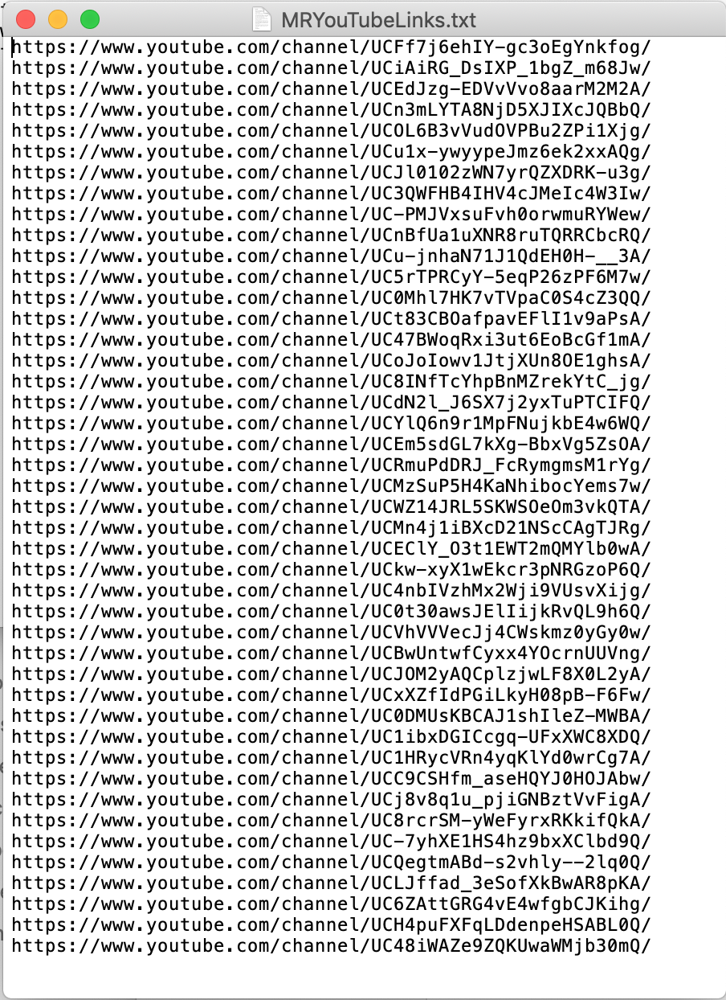
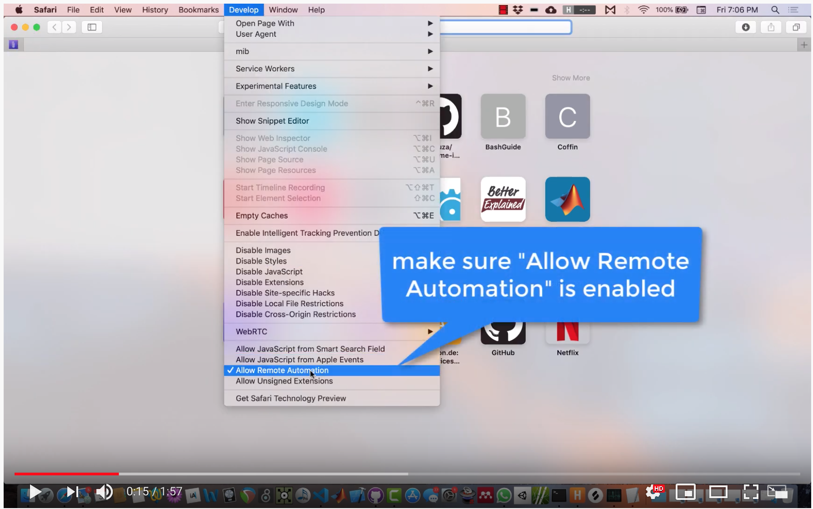

# MRYoutubePlaySubs
 
This repository contains the script and example text file for playing 
random videos of random channels. This idea was started by the \#ifollowyouyoufollowme 
movement on Facebook, where artist, musicians, composers, creatives, joined together
to increase their visibility during the social distancing of the Covid19 pandemic.

Since the numbers of new subscribers is (potentially) large, I created this script to
play back random videos of all the channels. This was done in an effort to discover new
content. As a side-effect, this should also allow everyone to increase their "minutes" played.

## Getting Started

You will need **Python 3** installed on your system. Currently this only works for **Safari** but other browsers (Chrome, Firefox) could be added as options if need be.

For help with your Python installation **[see](https://www.python.org)**, or use 
**[homebrew](https://brew.sh)** or **[MacPorts](https://www.macports.org)**. If using 
the package managers, don't forget to set update your **PATH** (MacOS ships with Python 2 by default, we want to ignore it!). 

For MacPorts (what I am using) run the following in the **terminal** (sudo means you will need to provide your user password): 

`sudo port install python38`

If you installed **MacPorts** it already updated the **PATH** in your `.bash_profile`... you are good to go.

To make sure everything worked:

`python3.8 -version`

should output:

`Python 3.8.2` (in my case)

To use the script we also need to install the **selenium** package. Run:

~`pip install selenium`~

~(might need to be **pip3** or **pip3.8** or whatever...).~

turns out that when installing **selenium** via **pip** you cannot use it from the Terminal. So instead use **MacPorts** again:

`sudo port install py38-selenium`

Now we should be ready to run the script...

## Run the script

You will need a .txt file with a different link to a youtube channel on each line.
It should look something like this:

Each line should contain a single link. Make sure there aren't any empty lines (although the code should strip them out 🤞).
There is a sample file in the repository you can use to test the script. Either add or replace the entries as needed or create your own... 

To run the script, open **Terminal**:

`python3.8 ./MRYoutubePlaySubs.py --links MRYouTubeLinks.txt --numVids 3`

This will run the script and using the file supplied with the `--links` argument. `--numVids` specifies the number of videos (3 in this case - this is also the default) to play from each channel before moving on to the next on the list. 

Optional input: `--graceTime` adds extra/grace time after a channel is loaded to ensure that all the data we want is fully loaded (default 2 secs).

The script will run indefinitely, so to stop it either:
         close the browser window
         or ctrl + c (in the Terminal)

Only the text file with the links is REQUIRED. The others are optional:
       * -l or --links: path to a text file containing links to the channels
       * -n or --numVids: number of videos to play from each channel before moving on to the next (default 3)
       * (optional) -g or --graceTime: extra time after channel load to allow information to be downloaded (default 2)
       
Usage example:        

`MRYoutubePlaySubs.py -l TextfileWithLinks.txt -n 2')`

or

`MRYoutubePlaySubs.py --links TextfileWithLinks.txt --numVids 10 -g 1`

For this example, rather than playing the whole video before moving on to the next, I hardcoded it to *5 seconds* to show the concept:

As you can see in the video above, you need to **enable** the **Developer Settings** in Safari manually (only once unless you turn it off) so **selenium** is granted access. After that, `cd` into the working folder, input the information as shown and you are good to go. 